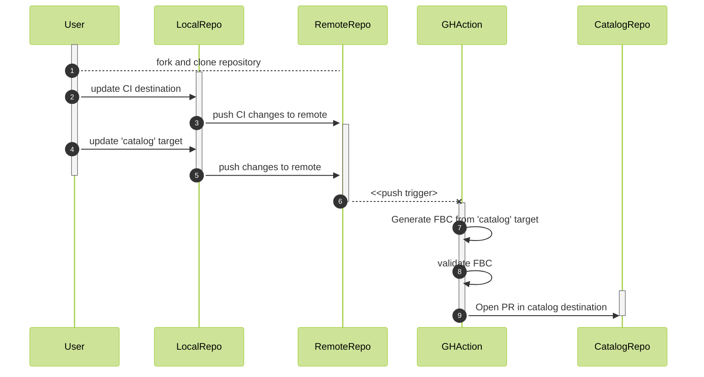

# example-operator-index
Welcome! This repository provides a starting point for those interested in maintaining the catalog information for their operator and illustrates how that information contributes to an overall catalog ecosystem. 


## Quickstart
1. fork this repository
2. adjust destination fields in .github/workflows/ci.yaml as necessary, commit and push changes
3. adjust Makefile `$OPERATOR_NAME` for your operator's name
2. decide on an approach: basic veneer, semver veneer, custom veneers, raw FBC, etc. and adjust the 'catalog' target in Makefile to generate your desired FBC
4. run local tests (`make catalog`, `make validate`, etc.) until happy with the generated FBC
6. add, commit, and push the changes
7. verify that CI passes and opens a PR in the catalog repository


## Detailed HOWTO
### Actors and Terms
- [`File-Based Catalog`](https://olm.operatorframework.io/docs/reference/file-based-catalogs/) (FBC) is the declarative expression of operators and their relationships with other operators, other versions of themselves.
- [`Veneers`](https://olm.operatorframework.io/docs/reference/veneers/) are a general class of objects which can provide a simplified interaction with FBC.
- `Operator Author` is the role related to expressing an individual operator versions, channels, properties, etc. in a destination catalog.
- `Catalog` is the destination FBC-based catalog composed of the FBC contributions of one or more operators.
- `Catalog Owner` is the role related to integrating Operator Authors' catalog contributions.
- `Catalog Contribution` is the FBC that an Operator Author needs to convey to the Catalog Owner.  The format needs to be negotiated with the Catalog Owner.
For this example, the Catalog Owner receives contributions of a single, unversioned directory named after the operator which contain all FBC files, e.g.:

```tree
catalog
└── testoperator
    ├── .indexignore
    ├── OWNERS
    └── catalog.yaml
```


### Lifecycle
This repository models a single operator author contributing their FBC to a catalog.  This repository has pre-configured GitHub actions to deliver the FBC to an example [catalog GitHub repository](https://github.com/grokspawn/cool-catalog/).  The actions will generate the FBC from this repository and open a pull request on the catalog repository to merge them.  (See that repository for more information about the lifecycle steps after creating the pull request.)




1. Fork and Clone Remote Repository  
IMPORTANT!  Any operator-specific changes contributions to the parent repository will be discarded.

2. Update CI Destination  
Customize `.github/workflows/ci.yaml` to your needs, including setting the `destination_repo` to the URI of your catalog repository. 

3. Push Changes to Remote
Push the CI changes to the remote branch so they will trigger later when you push catalog contributions.

4. Update 'catalog' target
Locally, update the catalog target in the Makefile to generate your FBC.  Example targets are provided in the Makefile (with supporting artifacts) to support to the following scenarios:  
   1. Basic veneer generates FBC.
   2. Semver veneer generates FBC.
   3. Compound veneer generates and post-processes FBC. 

5. Push Changes to Remote  
Once the `catalog` make target and the resulting FBC are ready, push the changes to the remote repository.  This will trigger the remote actions to generate a pull request against the destination catalog repository as specified in #2.


<!--
## Demo
Recorded demo of modifying a `basic veneer` file "basic-veneer.yaml", generating an FBC from it, and pushing that FBC as a PR to a catalog repository.


 -->
